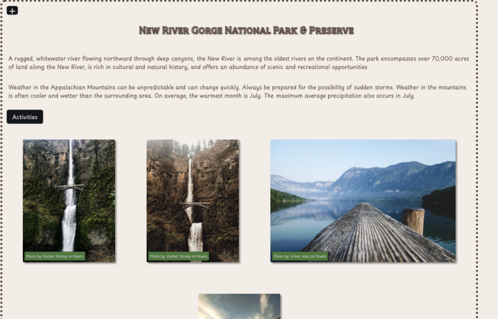

# National Parks Explorer

## Project Description

The goal of this application is to allow the user to aquire important national park information in a clean interactive window. The user will be able to search for a national park and be presented with important information such as fees and passes, tours, and closures in the park courtesy of the National Parks Service API. They will also be able to see images of the park they search for courtesy of the Pexel API.

## User Story

```md
AS A person who enjoys exploring national parks in the United States
I WANT a webpage that allows me to search for a specific national park
SO THAT I can obtain important information about the park and see images of the park I intend to visit
```

## Acceptance Criteria

```md
Use a CSS framework other than Bootstrap.

Be deployed to GitHub Pages.

Be interactive (i.e: accept and respond to user input).

Use at least two server-side APIs.

Include at least one modal, and does not use native browser alert, confirm, or prompt functionality.

Use client-side storage to store persistent data.

Be responsive.

Have a polished UI.

Have a clean repository that meets quality coding standards (file structure, naming conventions, follows best practices for class/id-naming conventions, indentation, quality comments, etc.).

Have a quality README (with unique name, description, technologies used, screenshot, and link to deployed application).
```

## Deployed Link

https://sean-k-madigan.github.io/NationalParkExplorer/

## Installation

N/A

## Usage

Demonstrates our ability to effectively, cohesively, and collaboratively work as work as a team. Additionally demostrates our ability to apply the information we have learned thus far.

## Credits

In no particular order:
Ben Schwendiman, Eric Edmunds, John Shumway, Brett Czerwinski, Sean Madigan

APIs used:
National Parks Service API
Pexel API

## License

See associated licenses

## Screenshot of application
